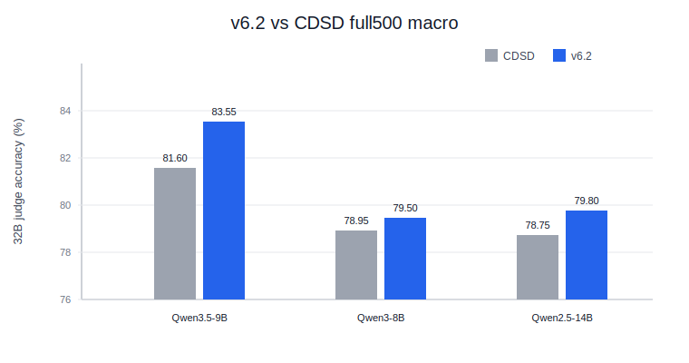
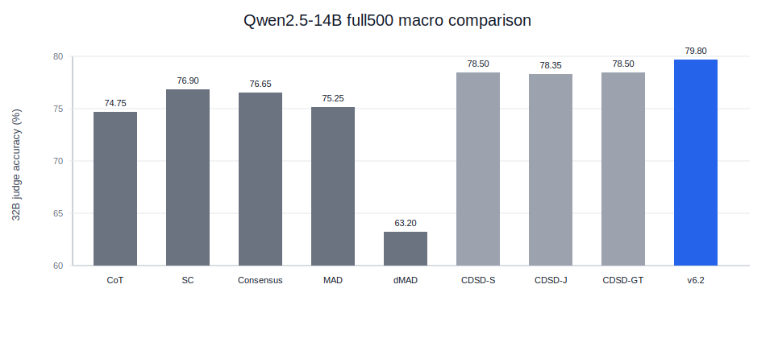

# v6.2 三投影证据辩论树独立报告

## 1. 一句话定位

v6.2 可以命名为 **Tri-Projection Evidence Debate Tree**。它不是普通三棵树投票，也不是 Tree-of-Thoughts 搜索，而是把多 agent debate 改写成一种围绕证据投影的结构化辩论：

```text
多个 agent 提出 evidence plan
→ referee 合成 shared agenda
→ 对 agenda 做 evidence cross-examination
→ 在三种证据投影下分别跑真实推理树
→ adjudicator 只在树终端叶之间裁决
→ projection agreement / span adjudication 做终局复核
```

这版最重要的特点是：**plan 只作为议程和证据视角，不允许直接提交最终答案；最终答案必须来自真实推理树终端，或来自终端 span 的规范化。**

## 2. 算法思想

### 2.1 多 agent evidence plan

每个 agent 先提出一个 evidence plan，包括：

- `answer_slot`：问题真正要求的答案槽位；
- `bridge_chain`：需要验证的多跳关系链；
- `selected_titles`：计划使用的 passages；
- `answer`：候选答案，只作为计划假设；
- `confidence` 和简短理由。

这一步可以理解为多个 debater 提出不同证据路线，而不是直接解题。

### 2.2 Resolved evidence agenda

referee 合并多个 evidence plans，得到一个 resolved plan。它相当于辩论后的 shared agenda / provisional motion。

resolved plan 会影响后续 focused evidence tree 和 focused contract tree，但不会绕过树直接赢。这个设计专门修复早期版本的问题：plan hallucination 不能直接覆盖真实推理树。

### 2.3 Plan validation

resolved plan 会被验证：

- bridge chain 是否被 passage 支持；
- selected titles 是否足以完成关系链；
- 是否出现 planner 自己承认的 unsupported assumption。

v6.2 不再用 hard gate 把 focused tree 关死，而是把 validation 作为选择和审计信号。这样避免 v5.2 那类“validator 过严，关掉有用投影”的失败。

### 2.4 三投影真实推理树

v6.2 对同一个问题跑三种真实推理树：

| 投影 | 输入视角 | 作用 |
| --- | --- | --- |
| `full_tree` | 完整上下文 | 保留所有证据，避免 plan 错误导致证据缺失 |
| `focused_evidence_tree` | 只保留计划选中的证据 | 降低 distractor 干扰 |
| `focused_contract_tree` | focused evidence + answer slot / bridge chain 约束 | 强化关系方向和答案槽位 |

三棵树都是真实推理树，不是后处理文本。最终 selector 只能在这些树的 terminal leaves 之间裁决。

### 2.5 Terminal leaf adjudication

最终选择器检查每个终端叶：

- 是否回答问题；
- answer type 是否匹配；
- 证据是否充分；
- 是否是最小可接受答案 span；
- full / focused / contract 投影之间是否互相支持或冲突。

之后有两个很小的终局修正：

- `projection_agreement_audit`：多个投影一致时，可以推翻单一投影的错误选择，但有 guard，避免过度修；
- `answer_canonicalization / compound_subanswer_override`：只在终端 span 层面做规范化，例如 `Miquette` -> `Miquette Giraudy`，或从复合答案中抽取 benchmark 所需的最小 span。

## 3. 轨迹审计：是否达到了设计目的

审计来源：

- `results/ldt/v62/*full500*.jsonl`
- `analysis/ldt/v5/v62_doc/v62_trace_mechanism_audit.csv`
- `analysis/ldt/v5/v62_doc/v62_final_vs_full_tree_proxy.csv`

### 3.1 核心结论

结论：**基本达到目的，而且轨迹证据比较强。**

| 审计项 | 结论 |
| --- | --- |
| 是否每题都有 evidence plans | 三个主模型、四个数据集均为 100% |
| 是否每题都有 resolved plan | 100% |
| 是否每题都有 plan validation | 100% |
| final 是否来自树终端或 span repair | 几乎 100%；Qwen2.5-14B 为 100% |
| 是否存在 plan answer 直接绕过树的可疑样本 | 0 |
| focused 投影是否真的被构造 | 多跳 QA 中约 99%-100%；StrategyQA 不使用 focused 投影 |
| selector 是否实际选择过非 full tree | 是，尤其 MuSiQue 上 18%-19% |
| final 相比 full_tree 是否有系统收益 | 是，Qwen2.5-14B macro local +15.35，Qwen3.5-9B +12.05 |

这说明 v6.2 不是“plan 直接给答案”的系统，而是真正把 evidence plan 变成了树推理的投影视角。

### 3.2 机制覆盖表

以下是 full500 轨迹审计。`final_from_tree_or_span_repair` 越接近 100，越说明最终答案仍来自树终端或终端 span 规范化。

| 模型 | 数据集 | evidence plan | focused evidence | focused contract | selector 选非 full | audit 改写 | span 规范化 | final 来自树/terminal span |
| --- | --- | ---: | ---: | ---: | ---: | ---: | ---: | ---: |
| Qwen3.5-9B | HotpotQA | 100.0 | 99.6 | 99.6 | 9.8 | 5.6 | 2.0 | 100.0 |
| Qwen3.5-9B | 2Wiki | 100.0 | 100.0 | 100.0 | 4.6 | 0.8 | 0.6 | 100.0 |
| Qwen3.5-9B | MuSiQue | 100.0 | 98.2 | 98.2 | 18.6 | 4.4 | 2.0 | 100.0 |
| Qwen3.5-9B | StrategyQA | 100.0 | 0.0 | 0.0 | 0.0 | 0.0 | 0.0 | 99.8 |
| Qwen2.5-14B | HotpotQA | 100.0 | 100.0 | 100.0 | 16.8 | 5.0 | 1.6 | 100.0 |
| Qwen2.5-14B | 2Wiki | 100.0 | 100.0 | 100.0 | 16.4 | 8.2 | 0.2 | 100.0 |
| Qwen2.5-14B | MuSiQue | 100.0 | 99.4 | 99.4 | 19.2 | 3.2 | 1.4 | 100.0 |
| Qwen2.5-14B | StrategyQA | 100.0 | 0.0 | 0.0 | 0.0 | 0.0 | 0.0 | 100.0 |

StrategyQA 是 yes/no 问题，没有 full-context distractor passages，所以 focused 投影自然不启用。这不代表机制缺失。

### 3.3 Final vs full_tree proxy

这里用 `full_tree` 的终端答案做一个粗 proxy，检查三投影 adjudicator 是否相对单 full tree 有收益。注意这不是 32B judge，而是本地 EM proxy。

| 模型 | 数据集 | v6.2 final EM | full_tree proxy EM | 差值 | final 改写 full_tree 次数 | 改写后正确 | 改写后错误 |
| --- | --- | ---: | ---: | ---: | ---: | ---: | ---: |
| Qwen3.5-9B | HotpotQA | 75.6 | 64.2 | +11.4 | 44 | 27 | 17 |
| Qwen3.5-9B | 2Wiki | 84.0 | 68.6 | +15.4 | 22 | 10 | 12 |
| Qwen3.5-9B | MuSiQue | 75.8 | 54.4 | +21.4 | 97 | 66 | 31 |
| Qwen3.5-9B | StrategyQA | 95.8 | 95.8 | +0.0 | 1 | 0 | 1 |
| Qwen3-8B | HotpotQA | 73.0 | 61.2 | +11.8 | 30 | 20 | 10 |
| Qwen3-8B | 2Wiki | 83.6 | 68.8 | +14.8 | 20 | 10 | 10 |
| Qwen3-8B | MuSiQue | 63.8 | 46.8 | +17.0 | 68 | 26 | 42 |
| Qwen3-8B | StrategyQA | 93.0 | 93.0 | +0.0 | 0 | 0 | 0 |
| Qwen2.5-14B | HotpotQA | 72.8 | 57.0 | +15.8 | 72 | 39 | 33 |
| Qwen2.5-14B | 2Wiki | 83.2 | 62.2 | +21.0 | 44 | 30 | 14 |
| Qwen2.5-14B | MuSiQue | 65.0 | 40.4 | +24.6 | 97 | 61 | 36 |
| Qwen2.5-14B | StrategyQA | 94.0 | 94.0 | +0.0 | 0 | 0 | 0 |

这个表说明：v6.2 的收益不是只来自某个文本清理函数。三投影 adjudication 在复杂多跳 QA 上确实经常改变 full tree 的终端答案，并且整体方向是正收益，尤其 MuSiQue 和 2Wiki。

### 3.4 代表轨迹审阅

**Case A：planner 错，但 final 没有被 plan 绑架**

MuSiQue `2hop__460946_294723`，问题是 “Who is the spouse of the Green performer?”。

- resolved plan 提出 `Norm Nixon`，并且 validation 判定 `supported=false`，理由包含 planner 自己的 unsupported assumption。
- full tree 给出 `Miquette`。
- focused evidence 给出 `Information not provided`。
- final 通过 canonicalization 从 `Miquette` 扩展到 `Miquette Giraudy`，最终正确。

这条轨迹支持 v6.2 的核心设计：plan 即使错，也不会直接提交答案；真实树和 terminal span adjudication 仍保有裁决权。

**Case B：focused contract 修复 full tree 的过宽答案**

MuSiQue `2hop__697790_864352`，问题是 “Who is the child of Caroline LeRoy's spouse?”。

- q35 full tree 输出 `Daniel Fletcher Webster`。
- focused contract tree 输出 `Fletcher Webster`。
- selector 选择 `focused_contract`，最终正确。

这符合 v6.2 的目标：contract 投影不是生成一个新答案，而是在已选证据范围内强调 answer slot，使终端叶更贴近 benchmark 需要的最小答案。

**Case C：focused evidence 修复 distractor / 缺证据问题**

2Wiki `f6e2b9280bdd11eba7f7acde48001122`，问题是 “Which country Mohammed Al-Modiahki's wife is from?”。

- full tree 输出 `Qatar`。
- focused evidence 和 focused contract 均输出 `China`。
- selector 选择 focused evidence，最终正确。

这说明三投影不是多树堆叠，而是把 full-context distractor 与聚焦证据视角分开辩论。

**Case D：仍有边界**

MuSiQue 上 plan validation 支持率较低，Qwen3.5-9B 只有 31.4%，Qwen2.5-14B 只有 23.2%。这说明 planner 经常会提出部分 unsupported agenda。v6.2 的防线是“不让 plan answer 直接赢”，但 planner 质量仍会影响 focused 投影的质量。

## 4. 和 baseline 的数字比较

### 4.1 多模型 full500：v6.2 vs CDSD / v3 / v4

Judge：Qwen2.5-32B LLM-judge。来源：`analysis/ldt/v5/v62_main_model_full500_matrix.csv`。



| 模型 | 数据集 | v6.2 | v4/v4.10 | v3 | CDSD | v6.2-CDSD |
| --- | --- | ---: | ---: | ---: | ---: | ---: |
| Qwen3.5-9B | HotpotQA | 84.6 | 83.8 | 83.4 | 83.2 | +1.4 |
| Qwen3.5-9B | 2Wiki | 82.4 | 82.4 | 82.2 | 82.2 | +0.2 |
| Qwen3.5-9B | MuSiQue | 71.4 | 70.0 | 65.2 | 65.2 | +6.2 |
| Qwen3.5-9B | StrategyQA | 95.8 | 95.8 | 95.8 | 95.8 | +0.0 |
| Qwen3.5-9B | Macro | 83.55 | 83.00 | 81.65 | 81.60 | +1.95 |
| Qwen3-8B | HotpotQA | 82.0 | 81.0 | 80.8 | 80.8 | +1.2 |
| Qwen3-8B | 2Wiki | 83.4 | 83.2 | 83.2 | 83.2 | +0.2 |
| Qwen3-8B | MuSiQue | 59.6 | 59.6 | 58.8 | 58.8 | +0.8 |
| Qwen3-8B | StrategyQA | 93.0 | 93.0 | 93.0 | 93.0 | +0.0 |
| Qwen3-8B | Macro | 79.50 | 79.20 | 78.95 | 78.95 | +0.55 |
| Qwen2.5-14B | HotpotQA | 82.2 | 80.8 | 81.2 | 81.2 | +1.0 |
| Qwen2.5-14B | 2Wiki | 81.8 | 81.2 | 81.4 | 81.4 | +0.4 |
| Qwen2.5-14B | MuSiQue | 61.2 | 58.6 | 58.4 | 58.4 | +2.8 |
| Qwen2.5-14B | StrategyQA | 94.0 | 94.0 | 94.0 | 94.0 | +0.0 |
| Qwen2.5-14B | Macro | 79.80 | 78.65 | 78.75 | 78.75 | +1.05 |

结论：v6.2 在三个主模型上 macro 都高于 CDSD；最大收益来自 MuSiQue，StrategyQA 基本持平。

### 4.2 Qwen2.5-14B full500：v6.2 vs CoT / SC / Consensus / MAD / dMAD / CDSD

来源：`tree_cdsd_github_prep/Tree-CDSD/tables/qwen25_14b_full500_against_baselines.csv`。



| 方法 | HotpotQA | 2Wiki | MuSiQue | StrategyQA | Macro |
| --- | ---: | ---: | ---: | ---: | ---: |
| CoT | 76.4 | 78.2 | 54.0 | 90.4 | 74.75 |
| Self-Consistency | 80.2 | 79.2 | 56.4 | 91.8 | 76.90 |
| Consensus | 79.6 | 78.6 | 57.4 | 91.0 | 76.65 |
| MAD | 79.4 | 77.0 | 55.0 | 89.6 | 75.25 |
| dMAD | 72.6 | 70.6 | 47.0 | 62.6 | 63.20 |
| CDSD-Soft | 81.2 | 81.4 | 57.8 | 93.6 | 78.50 |
| CDSD-JudgeFix | 81.0 | 81.6 | 57.2 | 93.6 | 78.35 |
| CDSD-Granularity+Type | 80.6 | 80.4 | 59.6 | 93.4 | 78.50 |
| v6.2 Tri-Projection Evidence Debate Tree | 82.2 | 81.8 | 61.2 | 94.0 | 79.80 |

结论：在 Qwen2.5-14B 上，v6.2 对所有列出的 baseline 都是 macro 最优，并且在四个数据集上均不低于最强 CDSD 变体。

### 4.3 Qwen3.5-9B 主结果

来源：`analysis/ldt/v5/v62_q35_full500_summary.csv`。

| 数据集 | local EM | local F1 | v6.2 judge | v4 best | v3 | CDSD | v6.2-CDSD |
| --- | ---: | ---: | ---: | ---: | ---: | ---: | ---: |
| HotpotQA | 75.6 | 80.31 | 84.6 | 83.8 | 83.4 | 83.2 | +1.4 |
| 2Wiki | 84.0 | 78.23 | 82.4 | 82.4 | 82.2 | 82.2 | +0.2 |
| MuSiQue | 75.8 | 75.48 | 71.4 | 70.0 | 65.2 | 65.2 | +6.2 |
| StrategyQA | 95.8 | 95.8 | 95.8 | 95.8 | 95.8 | 95.8 | +0.0 |
| Macro | 82.8 | 82.45 | 83.55 | 83.0 | 81.65 | 81.6 | +1.95 |

## 5. 论文叙事建议

v6.2 可以作为 Tree-CDSD 的强结果主版本，但叙事上要避免把它说成“简单三树投票”。更好的叙事是：

```text
多 agent 先围绕证据路线提出可辩论 agenda；
系统把 agenda 映射成 full / evidence / contract 三种证据投影；
每个投影都生成真实推理树；
最终 adjudicator 只在树终端论证之间裁决；
projection agreement 和 terminal span adjudication 作为终局复核。
```

这样它仍然是多 agent debate 题目，并且比 v8/v23 更适合做主表。

## 6. 局限与后续消融

v6.2 的轨迹也暴露了几个边界：

1. **planner 支持率不稳**：MuSiQue 上 plan supported 低，说明 evidence planner 仍会引入 unsupported agenda。
2. **selector 有时拒绝非 full 投影**：这能防止被错误 focused plan 带偏，但也可能错过正确 focused answer。
3. **span repair 需要消融**：canonicalization 和 compound subanswer override 虽然改动小，但应在论文中单独消融，证明收益不是纯工程清洗。
4. **StrategyQA 收益有限**：yes/no 数据集没有明显三投影优势，结果主要持平。
5. **和 v8 的关系**：v8 更干净地体现树上局部多 agent debate，v6.2 更像 evidence-projection structured debate。论文可以把 v8 作为机制解释和消融对象，把 v6.2 作为性能主版本。

建议消融：

- 去掉 focused evidence tree；
- 去掉 focused contract tree；
- 去掉 plan validation signal；
- 去掉 projection agreement audit；
- 去掉 terminal span canonicalization；
- 比较 final selector 与简单 majority / best-confidence selection。
